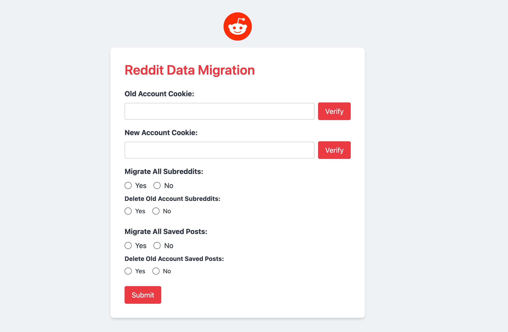

# Reddit-Migrate

A simple interface to migrate Reddit account data from an old account to a new account using Reddit APIs.



> **Caution** :warning: : This tool requires cookies from both the old and new Reddit accounts, which contain sensitive data (credentials). Never share these cookies with anyone.

## Demo

Check out the demo on YouTube: [Watch Demo](https://youtu.be/cpwPjjkW2O4)

## Installation

You can run the application either locally or using Docker.

### Local Installation

1. Make sure you have Go installed on your system. If not, you can install it [here](https://go.dev/dl/).

2. Clone this repository and navigate to the project directory:

   ```bash
   git clone https://github.com/nileshnk/reddit-migrate.git
   cd reddit-migrate
   ```

3. Install the necessary Go dependencies:

   ```bash
   go mod tidy
   ```

4. Run the application:

   ```bash
   go run .
   ```

5. You can also specify a custom address using the `--addr` flag:

   ```bash
   go run . --addr=":3000"
   ```

### Docker Installation

1. Make sure Docker is installed and running on your system.

2. Build the Docker image:

   ```bash
   docker build -t reddit-migrate-img .
   ```

3. Run the Docker container:

   ```bash
   docker run -it -d -p 5005:5005 --name reddit-migrate reddit-migrate-img
   ```

After setup, open the application in your browser at [http://localhost:5005](http://localhost:5005) or the custom address you provided during setup. Follow the steps below.

## Usage

### Steps:

1. **Retrieve Cookies**: Obtain the cookies for both your old and new Reddit accounts. You can follow this [video guide](./assets/cookie-retrieval.gif) for assistance.

   - Log in to Reddit in a desktop web browser.
   - Open a new tab and access the Network tab through developer tools (right-click and select Inspect).
   - Visit the URL [https://www.reddit.com/api/me.json](https://www.reddit.com/api/me.json) or any other Reddit page.
   - Locate the new request that appeared in the network tab.
   - Find the cookie and copy it by triple-clicking on it.
   - Repeat the same process for the other Reddit account.

2. **Paste Cookies**: Paste both cookies accordingly and verify their correctness.

3. **Select Options**: Choose the migration options based on your requirements.

4. **Submit**: Click the submit button to initiate the migration.

## Code Description

This tool uses Reddit's APIs to interact with Reddit servers using cookies from respective user accounts. Here's a brief overview:

- **Verification**: Clicking the verify button verifies the cookies. It checks for the presence of an access token in the cookie and validates the response from Reddit.

For subreddit migrations, the following steps are performed:

- Request a list of all subscribed subreddits and store their display names.
- Pass the names to a function that subscribes to the specified subreddits.
- Process subreddits in chunks of 100 names per request.
- Handle user accounts that are subscribed separately.
- Return success and failure counts.

For saved-posts migrations, these steps are followed:

- Request a list of all saved posts and store their full names.
- Pass the full names to a function that saves the posts.
- The function makes one API request per saved post, which may be subject to rate limits.
- Return success and failure counts.

Initially, this tool was written in JavaScript but was later rewritten in Go as an exercise to become familiar with the language.

## Contact

For any queries or suggestions, please feel free to contact me at [mail@inilesh.com](mailto:mail@inilesh.com).
