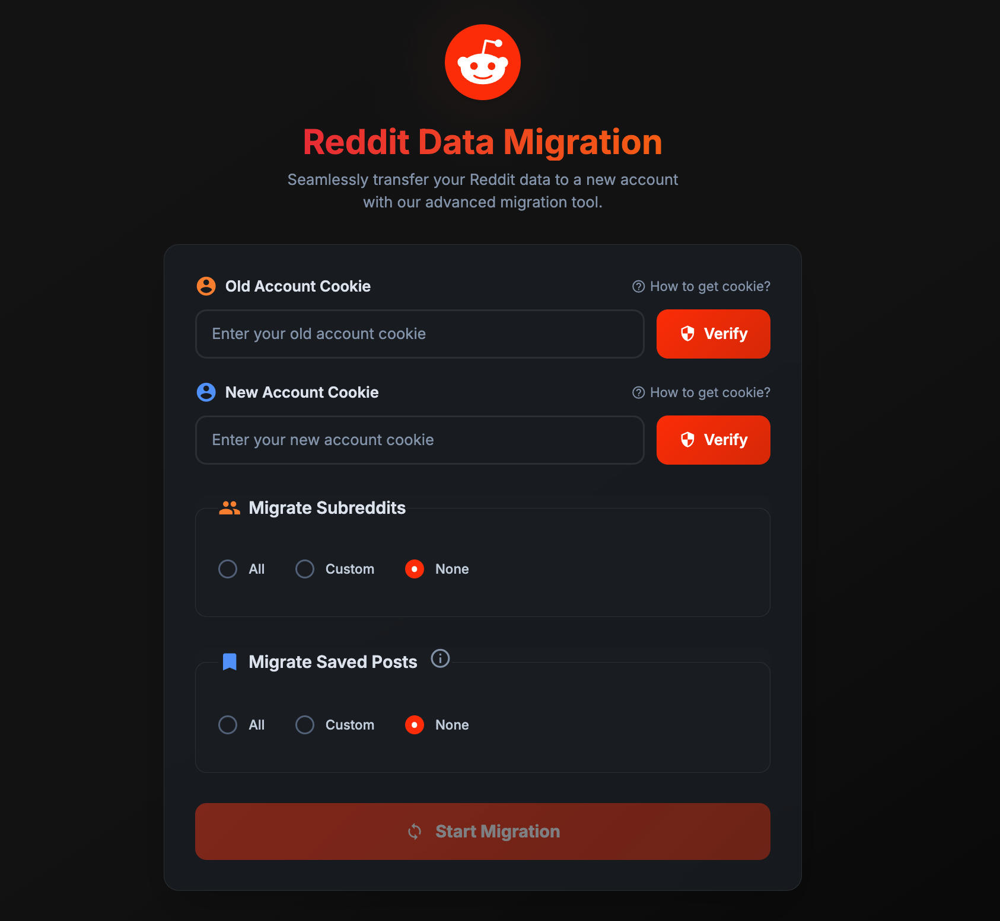

# Reddit-Migrate

Easily transfer your Reddit account data to a new account - including saved posts, subreddit subscriptions, and more.



## Why Reddit-Migrate?

- **Start Fresh**: Moving to a new Reddit account? Take your curated content with you
- **Simple Interface**: User-friendly web interface - no command line required
- **Bulk Transfer**: Migrate hundreds of saved posts and subreddit subscriptions in minutes
- **Safe & Private**: Runs locally on your computer - your data never leaves your machine

## What Can It Migrate?

✅ **Subreddit Subscriptions** - Transfer all your joined communities  
✅ **Saved Posts** - Move your saved posts collection  
✅ **User Follows** - Migrate followed user accounts

## Quick Start

### Download & Run

1. **Download** the latest release for your operating system from the [Releases page](https://github.com/nileshnk/reddit-migrate/releases)
2. **Extract** the downloaded ZIP file
3. **Run** the application:
   - **Windows**: Double-click `reddit-migrate.exe`
   - **Mac**: Run `./reddit-migrate` in terminal
   - **Linux**: Run `./reddit-migrate` in terminal

The app will open in your browser at `http://localhost:5005`

> **Security Note**: This tool requires Reddit cookies which contain sensitive data. Never share these cookies with anyone. The tool runs entirely on your local machine.

## How to Use

### Step 1: Get Your Reddit Cookies

You'll need cookies from both your old and new Reddit accounts:

1. Log in to Reddit in your browser
2. Open Developer Tools (F12 or right-click → Inspect)
3. Go to the Network tab
4. Visit [reddit.com/api/me.json](https://www.reddit.com/api/me.json)
5. Find the request in the Network tab
6. Copy the entire cookie value
7. Repeat for your other Reddit account

[See visual guide](./docs/assets/cookie-retrieval.gif)

### Step 2: Run the Migration

1. Paste the cookies for both accounts in the app
2. Click "Verify" to check the cookies are valid
3. Select what you want to migrate
4. Click "Submit" to start the migration

> **Note**: Large migrations (50+ saved posts) may take several minutes due to Reddit's rate limiting. Keep the browser tab open until completion.

## Building from Source

If you prefer to build the application yourself:

```bash
# Clone the repository
git clone https://github.com/nileshnk/reddit-migrate.git
cd reddit-migrate

# Install dependencies
go mod tidy

# Run the application
go run .

# Or build a binary
go build -o reddit-migrate
./reddit-migrate
```

### Docker Option

```bash
# Build the Docker image
docker build -t reddit-migrate-img .

# Run the container
docker run -d -p 5005:5005 --name reddit-migrate reddit-migrate-img
```

## Demo

Watch it in action: [YouTube Demo](https://youtu.be/cpwPjjkW2O4)

## Important Notes

- This tool uses Reddit's official OAuth API
- Intended for personal use only - use your own Reddit API credentials
- Please follow Reddit's [API Terms](https://www.reddit.com/dev/api/) and [Content Policy](https://redditinc.com/policies)

## How It Works

Reddit-Migrate uses Reddit's official APIs with cookie authentication to transfer data between accounts:

**Cookie Verification**: Validates cookies by checking for access tokens and testing API responses  
**Subreddit Migration**: Fetches all subscribed subreddits and subscribes to them in batches of 100  
**Saved Posts**: Retrieves saved posts and saves them individually (subject to rate limits)  
**User Follows**: Transfers followed user accounts to the new account

The tool runs entirely locally on your machine - no data is sent to external servers.

## Contact

For support or questions, contact [mail@inilesh.com](mailto:mail@inilesh.com)
