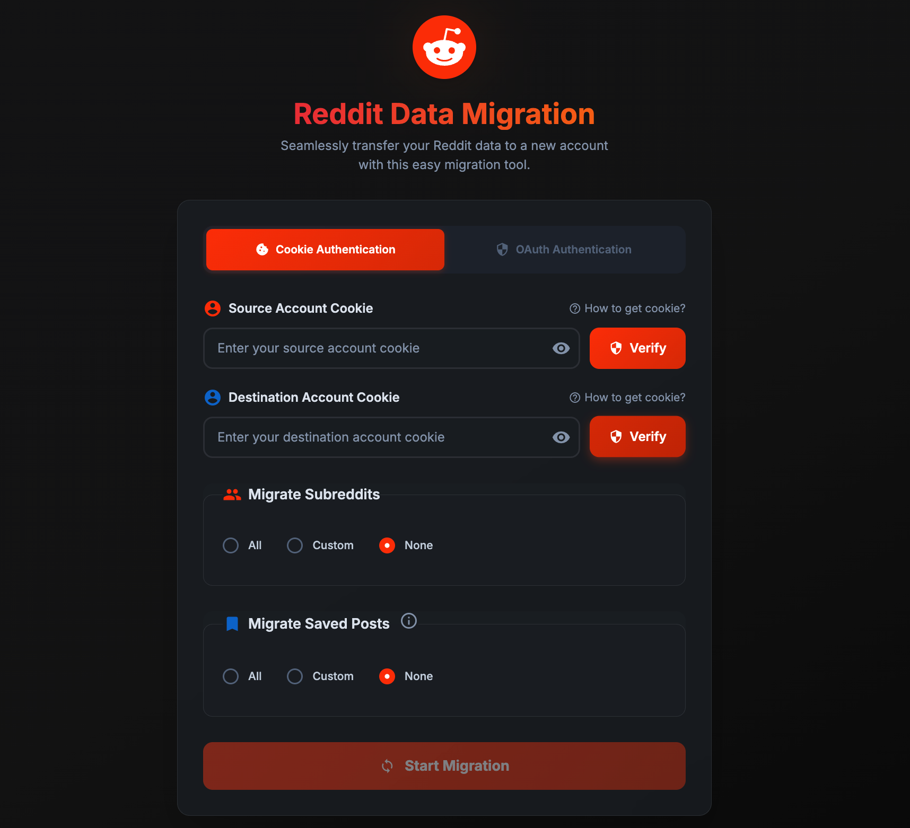

[](https://opensource.org/licenses/MIT)
[](https://github.com/nileshnk/reddit-migrate/actions)
[](https://github.com/nileshnk/reddit-migrate/releases)

# Reddit-Migrate

Easily transfer your Reddit account data to a new account - including saved posts, subreddit subscriptions, and more.



## Features

- **Simple Interface**: User-friendly web interface - no command line required
- **Dual Authentication**: Support for both OAuth and Cookie-based authentication methods
- **Bulk Transfer**: Migrate hundreds of saved posts and subreddit subscriptions
- **Smart Migration**: Automatically filters out duplicates and existing items to avoid conflicts
- **Privacy First**: Runs locally on your computer - your data never leaves your machine
- **Cross-Platform**: Available for Windows, Mac, and Linux

## What Gets Migrated

**Subreddit Subscriptions** - Transfer all your joined communities  
**Saved Posts** - Move your saved posts collection  
**User Follows** - Migrate followed user accounts

## Quick Start

### Download & Run

1. **Download** the latest release for your operating system from the [Releases page](https://github.com/nileshnk/reddit-migrate/releases)
2. **Extract** the downloaded ZIP file
3. **Run** the application:
   - **Windows**: Double-click `reddit-migrate.exe`
   - **Mac**:
     - Open your Terminal application.
     - Drag the `reddit-migrate` file from Finder into the Terminal window and press Enter.
     - Alternatively, navigate to the extracted folder in Terminal (e.g., `cd path/to/reddit-migrate`) and run `./reddit-migrate`.
     - _Note: You might need to grant execution permissions first by running `chmod +x reddit-migrate` in the Terminal._
   - **Linux**:
     - Open your terminal.
     - Navigate to the extracted folder (e.g., `cd path/to/reddit-migrate`).
     - Make the file executable by running `chmod +x reddit-migrate`.
     - Run the application with `./reddit-migrate`.
     - Alternatively, some desktop environments may allow you to run it by double-clicking from the file manager (ensure it has execute permissions).

The app will open in your browser at `http://localhost:5005`

> **Security Note**: This tool requires either Reddit OAuth credentials or cookies which contain sensitive data. Never share these credentials with anyone. The tool runs entirely on your local machine for maximum privacy.

## Usage Guide

### Authentication Methods

Choose between two authentication methods:

#### Method 1: OAuth Authentication (Recommended)

1. **Create Reddit App**: Go to [Reddit App Preferences](https://www.reddit.com/prefs/apps)
2. **Click "Create App"** and select "web app"
3. **Set redirect URI** to: `http://localhost:5005/api/oauth/callback`
4. **Copy Client ID and Secret** from your created app
5. **Enter credentials** in the OAuth tab and follow the authentication flow

#### Method 2: Cookie Authentication (Alternative)

1. Log in to Reddit in your browser
2. Open Developer Tools (F12 or right-click → Inspect)
3. Go to the Network tab
4. Visit [reddit.com/api/me.json](https://www.reddit.com/api/me.json)
5. Find the request in the Network tab
6. Copy the entire cookie value
7. Repeat for your other Reddit account

[See visual guide](./docs/assets/cookie-retrieval.gif)

### Run the Migration

1. **Authenticate** both accounts using your preferred method
2. **Verify** the accounts are properly connected
3. **Select** what you want to migrate
4. **Submit** to start the migration

> **Note**: Large migrations (50+ saved posts) may take several minutes due to Reddit's rate limiting. Keep the browser tab open until completion.

## Development

### Building from Source

```bash
# Clone the repository
git clone https://github.com/nileshnk/reddit-migrate.git
cd reddit-migrate

# Install dependencies
go mod tidy

# Run the application
go run .

# Or build a binary
go build -o reddit-migrate
./reddit-migrate
```

### Docker

```bash
# Build the Docker image
docker build -t reddit-migrate-img .

# Run the container
docker run -d -p 127.0.0.1:5005:5005 --name reddit-migrate reddit-migrate-img
```

## Recent Updates

### Latest Features (v0.2.3)

- **OAuth Authentication**: Added official Reddit OAuth support as the recommended authentication method
- **Smart Migration**: Enhanced migration logic to filter out duplicates and existing items automatically
- **Improved Saved Posts**: Fixed chronological ordering - oldest posts are now properly preserved at the bottom
- **Better UX**: Dual-tab interface supporting both OAuth and Cookie authentication methods

### Previous Updates

- **Enhanced UI**: Modern, responsive interface with Reddit-themed styling
- **Rate Limiting**: Intelligent handling of Reddit's API rate limits
- **Error Handling**: Improved error messages and recovery mechanisms

## Demo

Watch it in action: [YouTube Demo](https://youtu.be/pHGYuwZ1Jp0)

## How It Works

Reddit-Migrate uses Reddit's official APIs with support for both OAuth and cookie-based authentication to transfer data between accounts.

- **OAuth Authentication**: Uses Reddit's official OAuth flow for secure API access with proper scopes
- **Cookie Authentication**: Extracts access tokens from Reddit cookies as an alternative method
- **Smart Migration**: Automatically detects existing items and only migrates new content to avoid duplicates
- **Subreddit Migration**: Fetches all subscribed subreddits and subscribes to them in batches of 100
- **Saved Posts**: Retrieves saved posts in proper chronological order and saves them individually
- **User Follows**: Transfers followed user accounts to the new account

The tool runs entirely locally on your machine - no data is sent to external servers.

## Important Notes

- This tool uses Reddit's official OAuth API
- Intended for personal use only - use your own Reddit API credentials
- Please follow Reddit's [API Terms](https://www.reddit.com/dev/api/) and [Content Policy](https://redditinc.com/policies)

## Support

For questions or issues, contact [mail@inilesh.com](mailto:mail@inilesh.com) or open an issue on GitHub.
